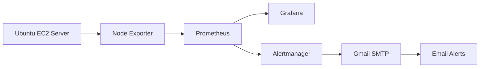
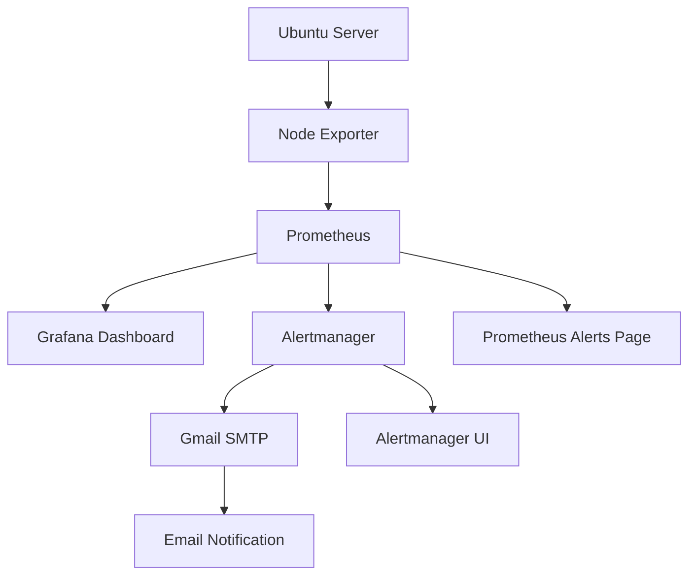

#  Real-Time Server Monitoring & Alerting System

Real-Time Server Monitoring & Alerting System is a Docker-based observability solution designed to provide real-time visibility into Linux server performance and proactively notify administrators about critical system events. The system leverages Prometheus for metrics collection, Node Exporter for exposing Linux system metrics, Grafana for interactive visualization, and Alertmanager for managing and delivering email notifications.

The monitoring stack continuously collects and analyzes key performance metrics such as CPU usage, memory consumption, disk utilization, and network traffic. Prometheus stores these metrics as time-series data, while Grafana transforms them into intuitive dashboards for easy analysis. Alert rules are configured to detect abnormal conditions, and Alertmanager ensures that timely notifications are sent via email whenever critical thresholds are exceeded.

This project is fully containerized using Docker and Docker Compose, making it lightweight, portable, and easy to deploy on cloud environments such as AWS EC2. It demonstrates core concepts of Monitoring, Observability, Infrastructure Management, and DevOps practices, providing a foundation that can be extended to support multi-server monitoring, container monitoring, Kubernetes environments, and advanced notification channels.


---

##  Features

*  Real-time CPU Monitoring
*  Memory Usage Monitoring
*  Disk Usage Monitoring
*  Network Traffic Monitoring
*  Interactive Grafana Dashboards
*  Email Alerts using Alertmanager
*  Dockerized Deployment
*  Infrastructure Monitoring & Observability
*  Easy to Scale and Extend

---

#  Architecture Diagram


---

## Tech Stack

| Category           | Technology     |
| ------------------ | -------------- |
| Operating System   | Ubuntu 22.04   |
| Cloud Platform     | AWS EC2        |
| Containerization   | Docker         |
| Orchestration      | Docker Compose |
| Metrics Collection | Prometheus     |
| Visualization      | Grafana        |
| Exporter           | Node Exporter  |
| Alerting           | Alertmanager   |
| Email Service      | Gmail SMTP     |

---

#  Project Structure

```text
real-time-server-monitoring-alerting-system/
│
├── docker-compose.yml
├── prometheus.yml
├── alert_rules.yml
├── alertmanager.yml
├── README.md
└── screenshots/
```

---

#  Prerequisites

* AWS Account
* GitHub Account
* Ubuntu 22.04 EC2 Instance
* Security Group Configuration
* Docker Installed
* Docker Compose Installed
* Git Installed

---

# Step 1: Launch EC2 Instance

### AMI

Ubuntu Server 22.04 LTS

### Instance Type

```text
t2.micro
```

### Storage

```text
8 GB
```

---

## Security Group Configuration

| Port | Service       |
| ---- | ------------- |
| 22   | SSH           |
| 3000 | Grafana       |
| 9090 | Prometheus    |
| 9093 | Alertmanager  |
| 9100 | Node Exporter |

---

# Step 2: Connect to EC2

Windows:

```powershell
ssh -i work.pem ubuntu@<PUBLIC-IP>
```

Verify:

```bash
hostname
```

---

# Step 3: Update Ubuntu

```bash
sudo apt update
sudo apt upgrade -y
```

---

#  Step 4: Install Docker

Install Docker:

```bash
sudo apt install docker.io -y
```

Start Docker:

```bash
sudo systemctl start docker
```

Enable Docker:

```bash
sudo systemctl enable docker
```

Check status:

```bash
sudo systemctl status docker
```

Verify:

```bash
docker --version
```

Add current user:

```bash
sudo usermod -aG docker $USER
newgrp docker
```

Test Docker:

```bash
docker ps
```

---

# Step 5: Install Docker Compose

```bash
sudo apt install docker-compose-v2 -y
```

Verify:

```bash
docker compose version
```

---

#  Step 6: Install Git

```bash
sudo apt install git -y
```

Verify:

```bash
git --version
```

---

#  Step 7: Create Project Directory

```bash
mkdir monitoring-project

cd monitoring-project
```

Verify:

```bash
pwd
```

Expected:

```text
/home/ubuntu/monitoring-project
```

---

# 📄 Step 8: Create docker-compose.yml

```bash
nano docker-compose.yml
```

Paste:

```yaml
services:

  prometheus:
    image: prom/prometheus
    container_name: prometheus

    ports:
      - "9090:9090"

    volumes:
      - ./prometheus.yml:/etc/prometheus/prometheus.yml
      - ./alert_rules.yml:/etc/prometheus/alert_rules.yml

  grafana:
    image: grafana/grafana
    container_name: grafana

    ports:
      - "3000:3000"

  node-exporter:
    image: prom/node-exporter
    container_name: node-exporter

    ports:
      - "9100:9100"

  alertmanager:
    image: prom/alertmanager
    container_name: alertmanager

    ports:
      - "9093:9093"

    volumes:
      - ./alertmanager.yml:/etc/alertmanager/alertmanager.yml
```

Save:

```text
CTRL + X

Y

ENTER
```

# Step 9: Create prometheus.yml

Create the Prometheus configuration file:

```bash
nano prometheus.yml
```

Paste:

```yaml
global:
  scrape_interval: 15s

rule_files:
  - "alert_rules.yml"

alerting:
  alertmanagers:
    - static_configs:
        - targets:
            - alertmanager:9093

scrape_configs:
  - job_name: 'node-exporter'
    static_configs:
      - targets:
          - 'node-exporter:9100'
```

Save the file:

```text
CTRL + X
Y
ENTER
```

---

#  Step 10: Create alert_rules.yml

Create alert rules:

```bash
nano alert_rules.yml
```

Paste:

```yaml
groups:
- name: linux-alerts

  rules:

  - alert: HighCPUUsage
    expr: 100 - (avg(rate(node_cpu_seconds_total{mode="idle"}[5m])) * 100) > 80
    for: 1m

    labels:
      severity: critical

    annotations:
      summary: High CPU Usage
      description: CPU usage is above 80%

  - alert: InstanceDown
    expr: up == 0
    for: 1m

    labels:
      severity: critical

    annotations:
      summary: Instance Down
      description: Target is unreachable
```

Save:

```text
CTRL + X
Y
ENTER
```

---

# 📧 Step 11: Create alertmanager.yml

Create Alertmanager configuration:

```bash
nano alertmanager.yml
```

Paste:

```yaml
global:
  smtp_smarthost: 'smtp.gmail.com:587'
  smtp_from: 'YOUR_EMAIL@gmail.com'
  smtp_auth_username: 'YOUR_EMAIL@gmail.com'
  smtp_auth_password: 'YOUR_APP_PASSWORD'

route:
  receiver: email-alert

receivers:
- name: email-alert
  email_configs:
  - to: 'YOUR_EMAIL@gmail.com'
    send_resolved: true
```

Replace:

* `YOUR_EMAIL@gmail.com`
* `YOUR_APP_PASSWORD`

Save:

```text
CTRL + X
Y
ENTER
```

---

#  Step 12: Start Containers

Start all services:

```bash
docker compose up -d
```

Verify running containers:

```bash
docker ps
```

Expected:

```text
CONTAINER ID
prometheus
grafana
node-exporter
alertmanager
```

---

#  View Running Containers

```bash
docker ps
```

View logs:

```bash
docker logs prometheus

docker logs grafana

docker logs alertmanager
```

---

# Step 13: Access Services

## Grafana

```text
http://<EC2-PUBLIC-IP>:3000
```

Default credentials:

```text
Username: admin
Password: admin
```

---

## Prometheus

```text
http://<EC2-PUBLIC-IP>:9090
```

---

## Alertmanager

```text
http://<EC2-PUBLIC-IP>:9093
```

---

## Node Exporter Metrics

```text
http://<EC2-PUBLIC-IP>:9100/metrics
```

---

#  Step 14: Configure Grafana

Login:

```text
Username: admin
Password: admin
```

Navigate:

```text
Connections
↓
Data Sources
↓
Add Data Source
↓
Prometheus
```

URL:

```text
http://prometheus:9090
```

Click:

```text
Save & Test
```

Expected:

```text
Successfully queried the Prometheus API.
```

---

#  Step 15: Import Grafana Dashboard

Navigate:

```text
Dashboards
↓
Import
```

Dashboard ID:

```text
1860
```

Click:

```text
Load
```

Datasource:

```text
Prometheus
```

Click:

```text
Import
```

---

#  Dashboard Metrics

The dashboard provides:

* CPU Usage
* Memory Usage
* Disk Usage
* Filesystem Utilization
* Network Traffic
* System Load
* Uptime
* Processes

---

#  Step 16: Verify Prometheus Targets

Open:

```text
http://<EC2-PUBLIC-IP>:9090/targets
```

Expected:

```text
node-exporter:9100

State: UP
```

---

#  Step 17: Verify Alert Rules

Open:

```text
http://<EC2-PUBLIC-IP>:9090/rules
```

Expected:

### HighCPUUsage

```text
State: OK
```

### InstanceDown

```text
State: OK
```

---

#  Prometheus Architecture



---

#  Useful Docker Commands

Start containers:

```bash
docker compose up -d
```

Stop containers:

```bash
docker compose down
```

Restart containers:

```bash
docker compose restart
```

View running containers:

```bash
docker ps
```

View container logs:

```bash
docker logs prometheus

docker logs grafana

docker logs alertmanager
```

#  Step 18: Test Alert Rules

To verify that Prometheus and Alertmanager are working correctly, generate high CPU usage on the Linux server.

Run the following commands:

```bash
yes > /dev/null &
yes > /dev/null &
yes > /dev/null &
yes > /dev/null &
```

These processes continuously consume CPU resources.

---

#  Step 19: Verify CPU Usage

Run:

```bash
top
```

or

```bash
htop
```

CPU usage should increase significantly.

---

#  Step 20: Verify Prometheus Alerts

Open Prometheus:

```text
http://<EC2-PUBLIC-IP>:9090/alerts
```

Expected:

```text
HighCPUUsage

State: FIRING

Severity: critical
```

---

#  Step 21: Verify Alertmanager UI

Open:

```text
http://<EC2-PUBLIC-IP>:9093
```

Expected:

```text
Receiver: email-alert

HighCPUUsage

FIRING
```

Alertmanager receives alerts from Prometheus and processes notifications.

---

#  Step 22: Verify Email Notifications

Alertmanager sends email alerts through Gmail SMTP.

Sample email:

```text
Subject:
[FIRING:1] HighCPUUsage

Message:

Alert Name: HighCPUUsage

Severity: Critical

Description:
CPU usage is above 80%
```

After CPU usage returns to normal, a recovery email will be sent automatically:

```text
[RESOLVED] HighCPUUsage
```

---

# Step 23: Stop CPU Stress

Terminate background processes:

```bash
killall yes
```

Verify:

```bash
top
```

CPU utilization should return to normal.

---

# 📸 Screenshots

Create:

```text
screenshots/
```

Store screenshots:

```text
screenshots/

├── grafana-dashboard.png
├── prometheus-targets.png
├── prometheus-alerts.png
├── alertmanager-ui.png
├── email-alert.png
└── docker-containers.png
```

---

#  Useful Docker Commands

### Start Services

```bash
docker compose up -d
```

### Stop Services

```bash
docker compose down
```

### Restart Services

```bash
docker compose restart
```

### View Containers

```bash
docker ps
```

### View Prometheus Logs

```bash
docker logs prometheus
```

### View Grafana Logs

```bash
docker logs grafana
```

### View Alertmanager Logs

```bash
docker logs alertmanager
```

---

#  Complete Monitoring Workflow




---

# Skills Demonstrated

* Linux Administration
* Docker
* Docker Compose
* Prometheus
* Grafana
* Alertmanager
* Monitoring & Observability
* Email Alerting
* Infrastructure Monitoring
* AWS EC2
* DevOps
* Site Reliability Engineering (SRE)

---

#  Final Project Structure

```text
real-time-server-monitoring-alerting-system/
│
├── docker-compose.yml
├── prometheus.yml
├── alert_rules.yml
├── alertmanager.yml
├── README.md
├── .gitignore
└── screenshots/
    ├── grafana-dashboard.png
    ├── prometheus-targets.png
    ├── prometheus-alerts.png
    ├── alertmanager-ui.png
    ├── email-alert.png
    └── docker-containers.png
```


---

## Project Summary

**Real-Time Server Monitoring & Alerting System** is a Docker-based observability solution that uses Prometheus for metrics collection, Grafana for visualization, Node Exporter for Linux metrics, and Alertmanager for email notifications, enabling proactive infrastructure monitoring and alerting.

